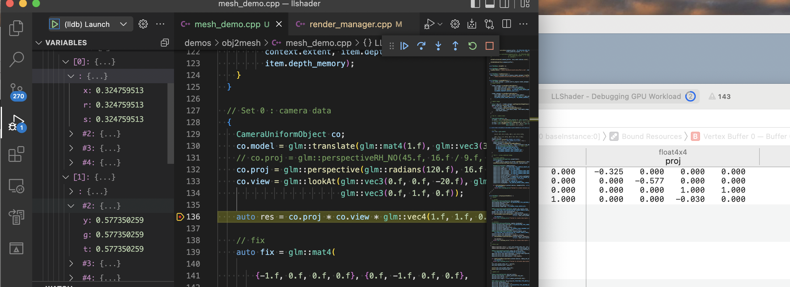

## Camera & Model Demo

### Detail
This demo demonstrated how to import obj file:

1. remove duplicated vertex data using `std::hash` and `std::unordered_map`

2. load texture and sample using `stb_image.h`
   
3. a eular angle implemented camera and a free quaternion camera

Fps camera:

Free Camera:

### Trap 

- If you are using vk-sdk 1.3.211.0 in Macbook Pro 14 2021(MacOS 12.4, M1 PRO), a GPU data bug show below, I solve it by updating sdk to 1.3.216.0.

    As you can see, my projection matrix has negative value in GPU, but non-negative in CPU.

- If you using `std::array` to create some vk create info, you should explict set all attribute you do not need to `nullptr`, or it will have a garbage value and crash.

- To use glsl `set` qualifer in vulkan, you index depends on how you create `PipelineLayout`, set index is the same as the order you coded at createinfo's `pSetLayouts` attribute.

- You should reverse texcoord's Y for Vulkan as well as `Projection[1][1]`

- The cursor coords is like mobile phone's coord system which y is toward screen bottom.

- If you using glm left hand, cross function direction are  also left hand.

### Further to do

- using dynamic uniform, big buffer with offset is better than multi buffer.
  
- when upload uniform data to gpu, map memory once would be nice rather than map and unmap each time.

- Recycle all allocated resource and using VMA header.