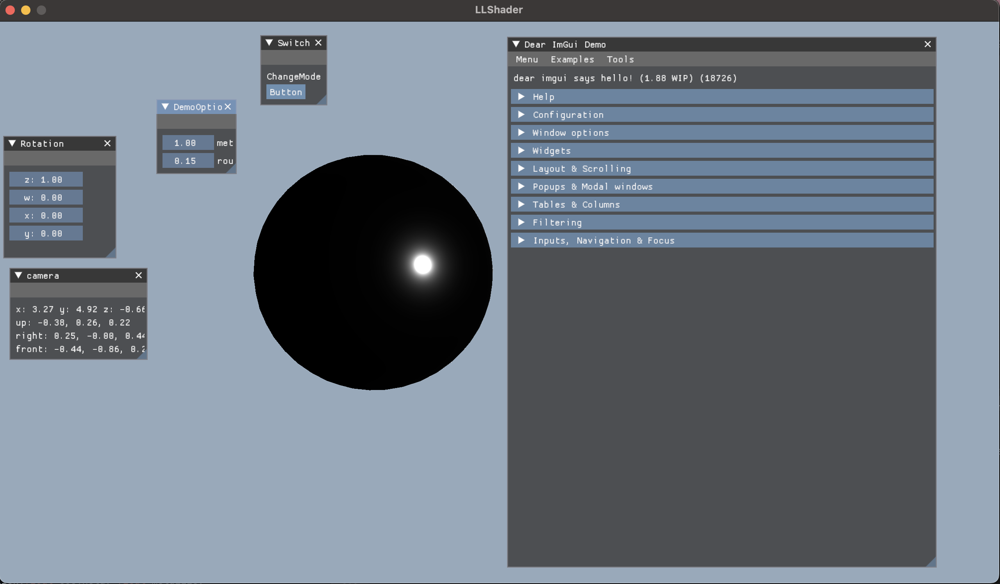

## Detail

- A very simply PBR ball, may contain some problems.

- D using GGX, F using Schlick approximation (Hard Code), G using SchlicksmithGGX.

- Metallic growing up.

- Roughness growing up.

## Trap

- This time should handle UI and data binding, each change on data response for a memcpy is bad.

## Further

- Energy lose , using `Kulla-Conty Approximate`  to fix.