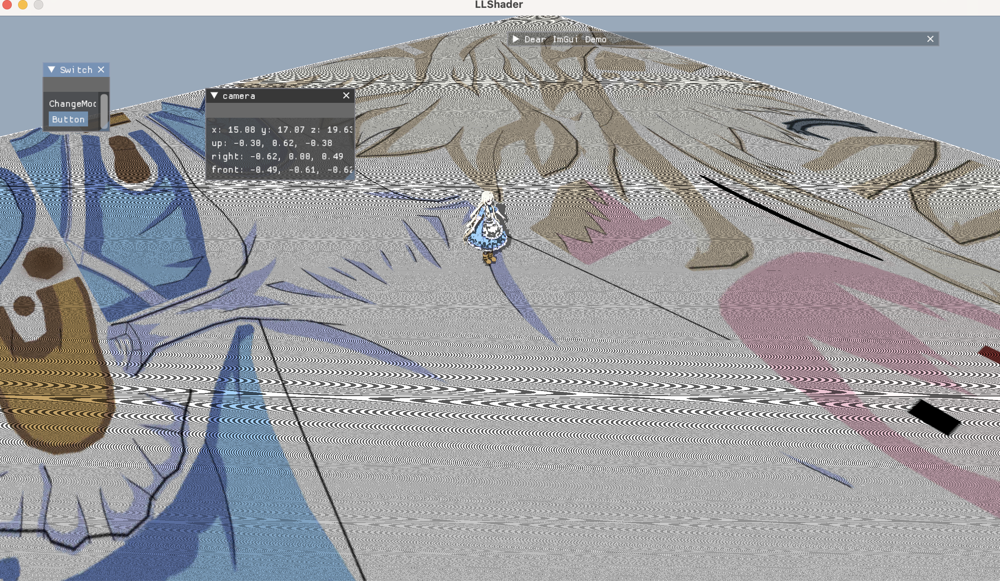
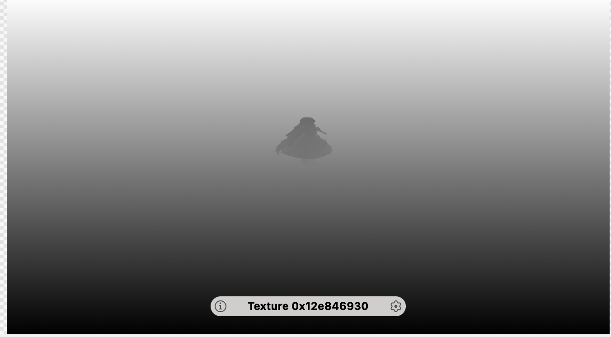
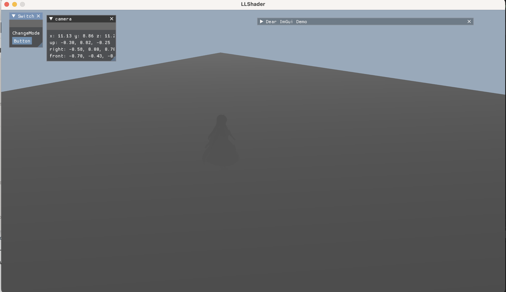
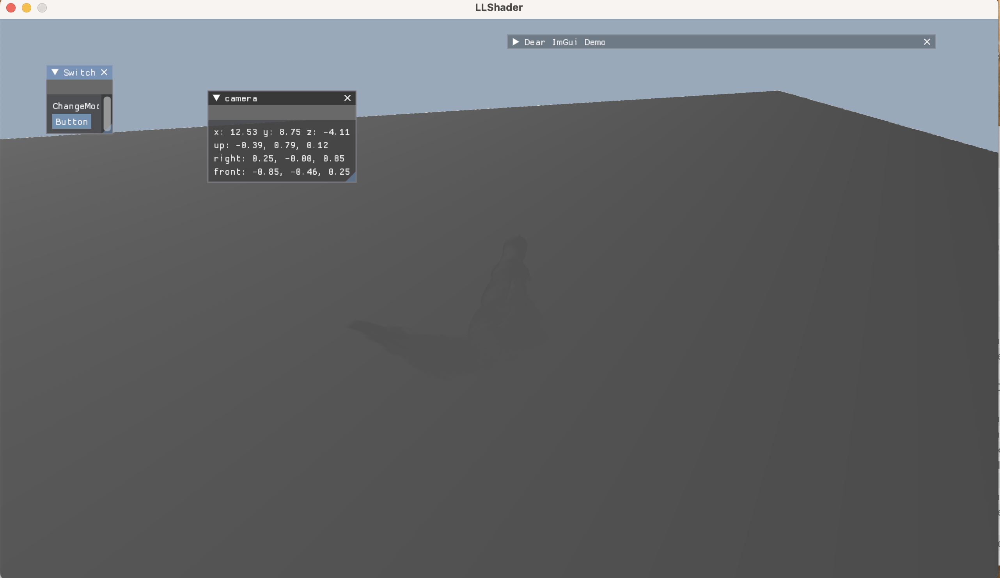
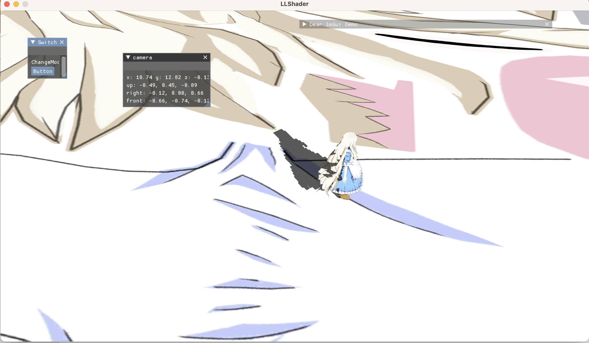
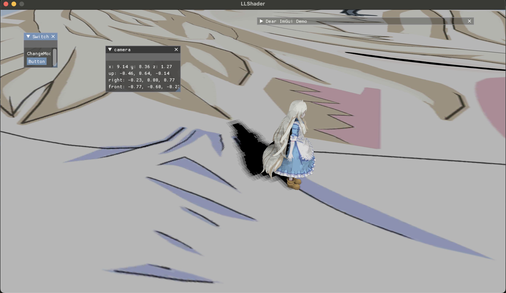
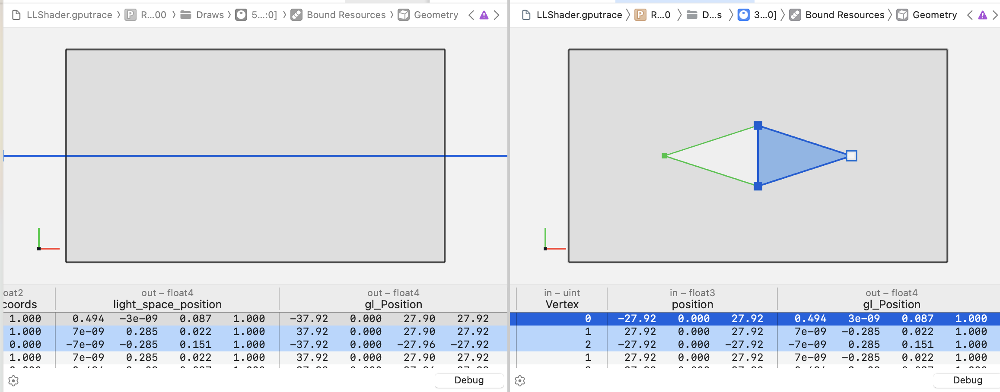

## Detail

- two way:   
  1. single framebuffer with the same depth attachment, and copy it from framebuffers's vkimage to you own vkimage.(demo direction light use this way.)
   
  2. multi framebuffer with different image, not need copy, store data in renderpass end. ( point light use this way, not in this demo, still in progress...)

- Using VkSubpassDependices to change shadow image layout, be caution about layout change in renderpass.

- Dynamic Uniform is fine, better than using multi set.

- Artifacts



- Depth Light View



- Depth Camera View



- Shadow in Camera Depth View
  


- Simple Shadow
    

- PCF (9 pixel sample)
    

## Trap

- VkMemory can only be mapped once before call unmap.

- If you need range copy, you can calculate offset and manipulate destination ptr at memcpy func.

- If scene not as expected direction, check GLM define and instruction branch, remember include glm.hpp randomly may not contain your #define data.


- My Device is M1 Pro, if your trach GPU data, you will find shadowmap pipeline's vertex stage gl_Position's Y is reversed rather than scence pipeline is the same as you multi light_space_martix at CPU. Because `MoltenVK` has implicit generate  `Metal Shader` with a code below:
```glsl
  // MacOS only.
  gl_Position.y = -(gl_Position.y); 
```



- When you change your coords from [-1,1] to [0,1], remember do not cover z component, this is Vulkan(Metal in MacOS, Z is 0 to 1)!

## Further

- Potin Light, CubeSampler and convert shadowmap to liner.
  
- Pcss, for a better soft shadermap.